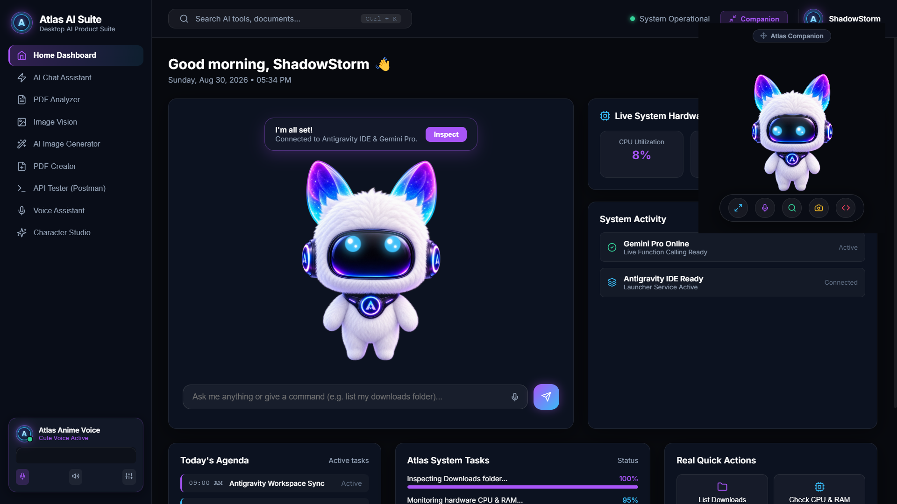

# Atlas AI Suite — Desktop Companion & Productivity Tools

> A modern desktop application built with Electron, React, and NestJS featuring an interactive animated digital companion character, local file system control, voice synthesis, and desktop productivity tools.



---

## ✨ Features Included

### 🤖 Interactive Companion Character
- **Digital Visor Eye Matrix:** 60fps HTML5 Canvas eyes with real-time cursor tracking.
- **Dynamic Eye Expressions:** Eyes react live to system states (`SPEAKING` equalizer waves, `WORKING` spinning ring, `THINKING` scanning orbits, `IDLE` pupils).
- **Companion Mini Window:** Toggleable compact overlay mode for quick actions.

### 💬 AI Chat Assistant & OS Control
- **Right-Aligned Chat Interface:** Clean chat workspace with push-to-talk microphone voice input.
- **OS Kernel Controls:** Launch local Windows apps via natural language (`"open file explorer"`, `"open calculator"`, `"open notepad"`, `"open task manager"`).
- **Local Directory Inspector:** View real system items in your `Downloads` folder with file size and modified timestamps.
- **Hardware Telemetry:** Real-time CPU utilization, RAM usage, and OS uptime monitoring.

### 🎙️ Cute Anime Female Voice Synthesizer
- **Voice Synthesis:** Upbeat female vocal synthesis with custom pitch tuning (`pitch = 1.65`).
- **Live Spectrum Visualizer:** Animated audio waveform spectrum in the sidebar footer synced to speech playback.

### 📄 PDF Document Analyzer
- **Local PDF Scanner:** Scans `.pdf` files in your local `Downloads` directory.
- **Summary & Insights:** Generates document takeaways and supports interactive Q&A over local PDFs.

### 🖼️ Image Vision & OCR Tool
- **Drag & Drop Upload:** Drag and drop or browse local image files (PNG, JPG, WEBP).
- **Visual Analysis:** Image thumbnail preview with text and visual graphics inspection.

### 🎨 AI Image Generator Studio
- **Text-to-Image Creation:** AI image generator with selectable aspect ratios (`1:1`, `16:9`, `9:16`).
- **Presets & Download:** Includes prompt presets, animated neon loader, and 1-click image saving.

### 📝 PDF Document Creator
- **Markdown Editor:** Write or generate markdown reports with live preview and PDF file export.

### ⚡ Postman-Style REST API Tester
- **HTTP Client:** Execute REST API calls (`GET`, `POST`, `PUT`, `DELETE`).
- **Payload & Headers:** JSON body payload editor, header configuration, HTTP status code (`200 OK`), and execution time (`ms`) inspector.

---

## 🛠️ Tech Stack

- **Desktop Shell:** [Electron](https://www.electronjs.org/)
- **Frontend UI:** [React](https://react.dev/), TypeScript, Vanilla CSS Glassmorphism (`@atlas-os/ui`)
- **Backend Service:** [NestJS](https://nestjs.com/), Node.js (`@atlas-os/backend`)
- **Monorepo Architecture:** `pnpm` workspaces (`apps/desktop`, `apps/backend`, `packages/ui`, `packages/character`, `packages/shared`)

---

## 🚀 Getting Started

### Prerequisites

- [Node.js](https://nodejs.org/) (v18 or higher)
- [pnpm](https://pnpm.io/) (v8 or higher)

### Installation

1. **Clone the Repository:**
   ```bash
   git clone https://github.com/Sidspidy/Atlas_OS.git
   cd Atlas_OS
   ```

2. **Install Dependencies:**
   ```bash
   pnpm install
   ```

3. **Configure Environment:**
   Create a `.env` file in the root directory (optional for cloud LLM features):
   ```env
   PORT=3001
   GEMINI_API_KEY=your_gemini_api_key_here
   ```

4. **Run in Development Mode:**
   ```bash
   # Start NestJS backend & Electron desktop application concurrently
   npm run dev
   ```

5. **Build for Production:**
   ```bash
   pnpm --filter @atlas-os/backend build
   pnpm --filter @atlas-os/desktop build
   ```

---

## 📁 Project Structure

```
Atlas_OS/
├── apps/
│   ├── backend/           # NestJS REST API & OS System Control Services
│   └── desktop/           # Electron Main & React Renderer Application
├── packages/
│   ├── character/         # Character Eye Expressions & State Machine
│   ├── shared/            # Shared Types & DTO Interfaces
│   └── ui/                # UI Glassmorphism Design System & AtlasCharacter
├── docs/
│   └── preview.jpg        # Application UI Preview Screenshot
├── package.json
└── README.md
```

---

## 📜 License

MIT License © 2026 ShadowStorm / Atlas OS
